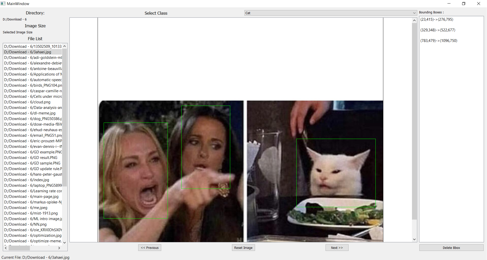

# BBox Tool
A simple tool for labeling object bounding boxes in images, implemented with Qt and C++. Feel free to use and share. **Any suggestions are welcome**.

# Usage
- select the directory you have images in
- create a classnames files, having one class label in one row
- select the classnames files
- click start
- select the first image from left list
- select the class of box you are going to create
- click and drag your mouse to create box around object of interest
- to delete a box, select the box from right list and click delete
- to remove all boxes click reset
- the output files will be in you image directory inside output folder

## Required
- qt 5 or greater
- opencv
- update the .pro file according to your opencv installation

## Tool pics and output 


**Output** is of form `label_idx, x_center, y_center, img_width, img_height`

```
1 0.132889 0.626943 0.224889 0.393782
1 0.378222 0.531088 0.171556 0.340933
2 0.835111 0.636788 0.278222 0.280829
```